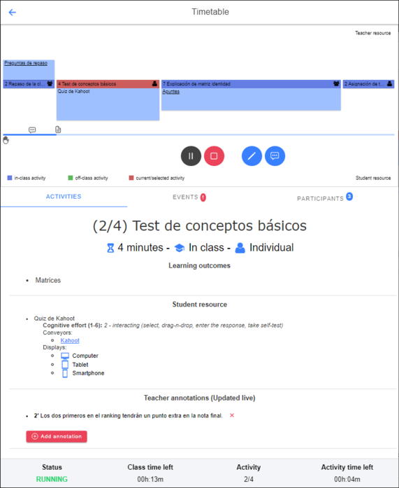

# Live Class Planner (based in [LePlanner](https://leplanner.ee))

<p align="center">
  <br></br>
  <b>LIVE VERSION:</b> <a href="https://classplanner.mblanco.me/" style="font-size:32px;">classplanner.mblanco.me</a>
</p>

## Introduction

This tool, implemented as a _Progressive Web App_, allows to test and work with [LePlanner](https://leplanner.ee) scenarios, a new concept for graphical visualization of Educational Modelling Languages (EMLs) designed and managed by the School of Digital Technologies of Tallinn University (TLU). Its purpose is to give assistance to teachers and students during the development of teaching/learning experiences. 

The original approach from _LePlanner_ is implemented and substantially extended considering its usage during classroom sessions, aiming to not only be useful as a classroom planner before the start of the sessions, but also throughout the session itself.

It includes functionalities like:

* Teachers can create a classroom session with a shareable PIN. Every student will be able to join using that PIN.
* Every classroom session makes use of a Leplanner learning scenario.
* Every user has got access to the list of connected teachers/students.
* Teachers can start/stop/pause/unpause the session. A running session runs goes over the activity blocks of the scenario until it finishes, showing all the information related to each activity.
* Interaction between teachers and students: Adding public and private annotations for each activity, asking for intervention, etc.
* A public timeline registers all the events that chronologically took place in the session, resulting in a full log of the session.

## Requirements
* [NodeJS](https://nodejs.org/es/)
* [Angular CLI](https://angular.io/guide/setup-local)
* [Ionic](https://ionicframework.com/docs/intro/cli)
* [Firebase CLI](https://firebase.google.com/docs/cli#npm)
* Existing Firebase project with Firestore, Firebase Functions* and, optionally, Firebase Hosting enabled.


\* Blaze plan ("pay as you go" plan) should be enabled for outbound petitions to work. In this case, API calls made to [LePlanner](https://beta.leplanner.net/) to ask for scenario data won't work with free plan. However Blaze Plan [normally remains free](https://firebase.google.com/pricing?hl=en) for small projects as the minimal bounds to get billed aren't reached.

## Installation

1. Download, extract, and open a terminal in the project directory.
2. Install the project dependencies:

```
npm install
```

3. Configure src/environments/environment.ts file with your Firebase project credentials:

```ts
export const environment = {
 production: false,
 firebase: {
   apiKey: "YOUR_API_KEY",
   authDomain: "YOUR_AUTH_DOMAIN",
   databaseURL: "YOUR_DATABASE_URL",
   projectId: "YOUR_PROJECT_ID",
   storageBucket: "YOUR_STORAGE_BUCKET",
   messagingSenderId: "YOUR_SENDER_ID"
 }
};
```

4. Initialize Firebase Services: Firestore, Functions and Hosting, and link them to the Ionic project.

```
firebase init
```

5. Run the project locally:

```
ionic serve
```

6 (Optional). Push and deploy the project to Firebase Hosting:

```
ionic build --prod
firebase deploy --only hosting
```
